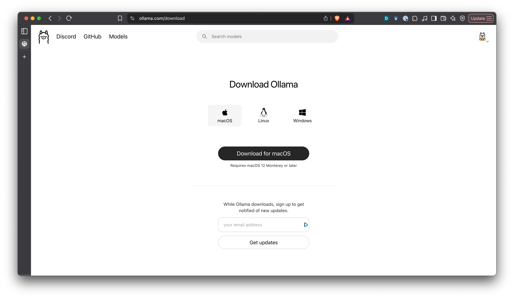

# RAG vs GraphRAG

## ⚒️ Pre-requisites

- [uv](https://docs.astral.sh/uv/getting-started/installation/#installation-methods) - Manejo de ambientes y dependencias en Python.
- [Ollama](https://ollama.com/)
- []

## Installation

1. Install `uv` following these based in your OS [instructions](https://docs.astral.sh/uv/getting-started/installation/#installation-methods).

2. Install python version used in the project:

```bash
uv python install 3.11
```

3. Create a virtual environment:

```bash
uv venv --python 3.11
```

4. Activate the virtual environment and install dependencies:

```bash
source .venv/bin/activate
uv sync
```

5. Install Ollama following the instructions in the official page. Select the installer according to your OS.



6. Download ollama models:

Embedding model:
```bash
ollama pull bge-m3:latest
```

LLM model:
```bash
ollama pull gemma3n:e4b
# or
ollama pull gemma3n:e2b
```

6. Install Neo4j Desktop.


## Exploratory Analysis of the data

## Documents to index creation

1. Launch [graph_eda notebook](graph_eda.ipynb):

```bash
# jupyter
uv run jupyterlab
# jupyterlab
```


## Creación del grafo de conocimiento

1. Levanta la base de datos de Neo4j usando docker:
```bash
docker run \
  --name neo4j \
  -p 7474:7474 -p 7687:7687 \
  -e NEO4J_AUTH=neo4j/test12345 \
  -e NEO4J_ACCEPT_LICENSE_AGREEMENT=yes \
  -e NEO4J_dbms_memory_pagecache_size=512M \
  -e NEO4J_dbms_memory_heap_initial__size=512M \
  -e NEO4J_dbms_memory_heap_max__size=512M \
  -e NEO4J_dbms_security_procedures_unrestricted="apoc.meta.*,apoc.coll.*" \
  -e NEO4J_dbms_security_procedures_allowlist="apoc.meta.*,apoc.coll.*" \
  -v $HOME/neo4j/data:/data \
  -v $HOME/neo4j/logs:/logs \
  -v $HOME/neo4j/import:/import \
  -d neo4j:2025.01.0
```

2. Ve a `http://0.0.0.0:7474/browser/` usando el navegador. Saldra una ventana como la siguiente:


3. En `username` coloca neo4j y en `Password` coloca test12345.

## Notebook

```bash
jupyter
```