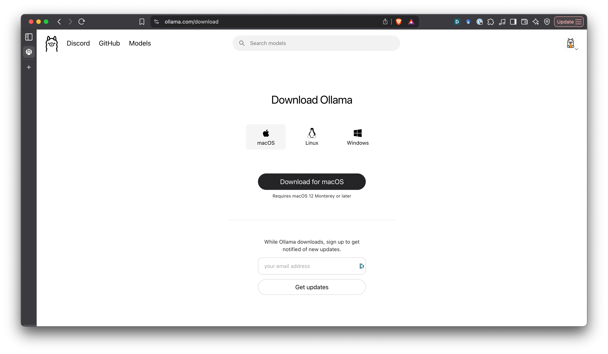
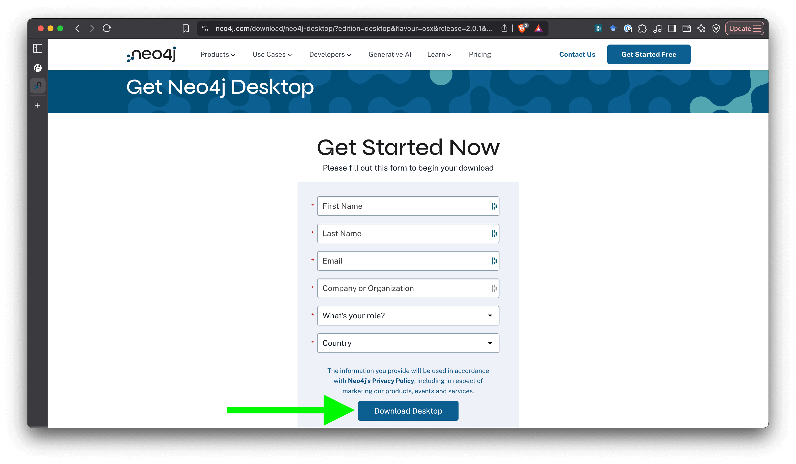
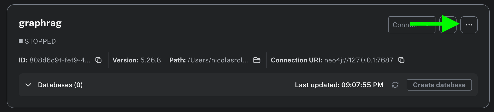

# The RAGening: what retrieval can learn form a certain animated town.
**A workshop on Retrieval-Augmented Generation using The Simpsons Dataset.**

This repository contains the code, notebooks, and resources used in our hands-on workshop that explores:

- What Retrieval-Augmented Generation (RAG) is and why it matters  
- How to build a basic RAG pipeline using Open Source tools + OpenAI too
- What Graph-RAG is and how it improves on standard RAG  
- How to apply both approaches using *The Simpsons Dataset*

##  Workshop Sections

1. **Context**  
   Previous context on LLMs and retrieval

2. **Intro to RAG**  
   Chunking, embeddings, vector stores, retrievers, and generation.

3. **Dataset Exploration**  
    Basic exploration of the dataset to understand what we are working with

4. **Hands-On RAG**  
    Build your own RAG pipeline using LangChain and FAISS.

5. **Limitations & Motivation for Graph RAG**  
    Where RAG falls short and how GraphRAG can help solve some of these issues.

6. **Graph RAG Deep Dive**  
    How connecting entities improves retrieval and answer grounding.

7. **Hands-On GraphRAG**  
    Build your own GraphRAG using Llamaindex, Ollama and Neo4j.

## 🗂️ Repository Structure

```bash
graph-rag-simpsons/
├── README.md       # You're here!
├── pyproject.toml  # Project Dependencies
├── .python-version  # Project's default Python version
├── .gitignore  # Files and patterns to be ignored by git version control
├── config.yaml  # Configuration values for the application
├── uv.lock  # Cross-platform lockfile that contains exact information about the dependencies
├── rag/        # Notebooks and files for the hands-on RAG exercise 
├── graph_rag/      # Notebooks and files for the GraphRAG implementation
├── data/       # The Simpsons Dataset files + some bonuses
└── eda/        # Simple Exploratory Data Analysis
└── images/        # Image assets
```

## Setup

### Python Environment

1. Install `uv` following these [instructions](https://docs.astral.sh/uv/getting-started/installation/#installation-methods) based in your OS.

2. Install python version used in the project:

```bash
uv python install
```

3. Create a virtual environment:

```bash
uv venv
```

4. Activate the virtual environment and install dependencies:

```bash
source .venv/bin/activate
uv sync
```

### LLM Configuration: Ollama installation

Ollama is an open-source framework for running large language models (LLMs) locally on your computer without relying on cloud providers. We will use ollama to do all the LLM calls in our application

1. Install Ollama following the instructions in the [official page](https://ollama.com/download). Select the installer according to your OS.



2. Open your terminal and download the following models using ollama CLI:

Embedding model:
```bash
ollama pull bge-m3:latest
# smaller model
ollama pull nomic-embed-text
```

LLM model:
```bash
ollama pull gemma3n:e4b
```

### Graph (and vector) database configuration

For this workshop, we will use [Neo4j](https://neo4j.com/), a graph database management system (GDMS) and launch an instance locally.

1. Install Neo4j Desktop.


Fill out the form and click on `Download Desktop`.



2. Create a new Neo4j instance.


Set your credentials to access the database and click on `Create`.


3. Install plugins.

Click on the three dots in the top-right corner and then in plugins:




Install the `APOC`, `GenAI` and `Graph Data Science` plugins.


4. Modify the `neo4j.conf` file. Open the `neo4j.conf` file by clicking on the three dots again and then in `neo4j.conf`. If no program is configured to open it, you will be prompted to choose an text editor to open it.


Once opened, look for the following line:

```bash
dbms.security.procedures.unrestricted=gds.*
```

replace by the following line, save and close the file:

```bash
dbms.security.procedures.unrestricted=apoc.*,gds.*,genai.*
```

5. Start the instance by clicking in the following button. This will change the status to `STARTING`:


Once the instance is ready, you should see how the status changed to `RUNNING`.


6. Create a new database and name it `simpsons`:


You should see the new instance listed. Don't mind the other too.


You are now ready to start building your RAG and GraphRAG systems!

## How to run it?

### Exploratory Analysis of the data

1. Check [basic_eda.ipynb](basic_eda.ipynb) notebook. If you want to run it:

```bash
# jupyter
uv run jupyter notebook basic_eda.ipynb --port=9991
# jupyterlab
uv run jupyterlab notebook basic_eda.ipynb --port=9991
```

### RAG

1. Launch [rag notebook](rag/rag_limited.ipynb) by running the following commands in the terminal and follow instructions 

```bash
cd rag
# jupyter
uv run jupyter notebook rag_limited.ipynb --port=9992
# jupyterlab
uv run jupyterlab notebook rag_limited.ipynb --port=9992

```

### GraphRAG

1. Launch [graph_rag notebook](graph_rag/graph_rag.ipynb) by running the following commands in the terminal and follow instructions 

```bash
cd graph_rag
# jupyter
uv run jupyter notebook graph_rag.ipynb --port=9993
# jupyterlab
uv run jupyterlab notebook graph_rag.ipynb --port=9993
```

## When & Where

🗓️ July 2025  
📍 PyCon Colombia

## Who’s this for?

- ML engineers, data scientists and AI engineers who want to understand RAG & Graph RAG.
- Developers building intelligent apps with LLMs.
- Fans of The Simpsons who love tech 💛.

## Presented by
- [Nicolás Roldán Fajardo](https://www.linkedin.com/in/nicolas-roldan-fajardo/) – ML Engineer 
- [María Fernanda Rojas Castro](https://www.linkedin.com/in/mfernandarojasca/) – Data/ML Engineer  
